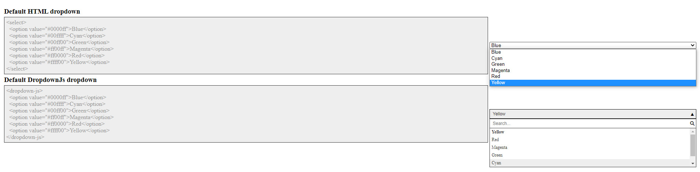

# Dropdown-JS
Dropdown-Js is a searchable dropdown element.
This can be used in a similar way as the native dropdown.

## Table of content
1. [Element arguments](#Element-arguments)
2. [Functions](#functions)

### Element arguments
#### Default Button Placeholder
A default placeholder can be defined if no option selected with `selection-placeholder`.
By default, `Select` is used as placeholder.
```html
<dropdown-js selection-placeholder="Hello">
```
#### Default filter placeholder
A default placeholder can be defined for the search input field with `filter-placeholder`.
By default, `Search...` is used as placeholder.
```html
<dropdown-js filter-placeholder="World">
```
#### Default selection
A default selection can be defined with `default`.
```html
<dropdown-js default="#ff00ff">
```
#### Search behaviour
Maybe someone wants to change the search behaviour. 
This can be done by settings a regex as `filter`.
The `{{var}}` part will be replaced by searched characters (separated by space).
```html
<dropdown-js filter="^{{var}}.*">
```
#### Number of visible options
The number of (at once) visible options can be defined with `show-options`.
```html
<dropdown-js show-options="10">
```
### Functions
#### Onchange
This element supports change Events.
```js
demo = document.getElementById('...');
demo.addEventListener('change', function(e) {
  console.log(`Selected: ${e.text}=${e.value}`);
});
```
#### Add a new option
A new option can be defined with `value` and `text`.
```js
demo = document.getElementById('...');
demo.addOption(value, text);
```
#### Remove an existing option
A existing option can be remove by providing the `value`.
```js
demo = document.getElementById('...');
demo.removeOption(value);
```
#### Manually select an option
Sometimes its required to select a default option manually (e.g. after appending new options).
```js
demo = document.getElementById('...');
demo.selectOption(value);
```
#### Number of visible options
It's also possible to set the number of (at once) visible options.
```js
demo = document.getElementById('...');
demo.showOptions(count);
```
#### Manually toggle dropdown
If required, its possible to toggle the dropdown manually.
```js
demo = document.getElementById('...');
demo.toggleDropdown();
```